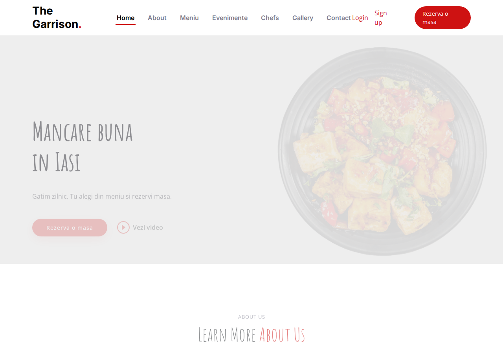
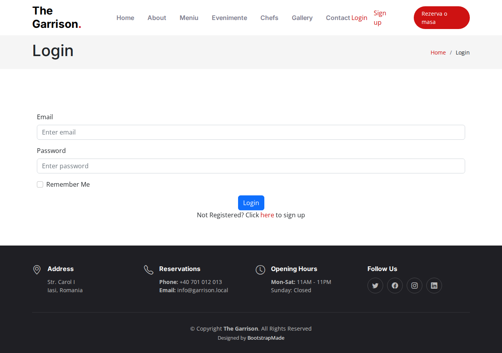
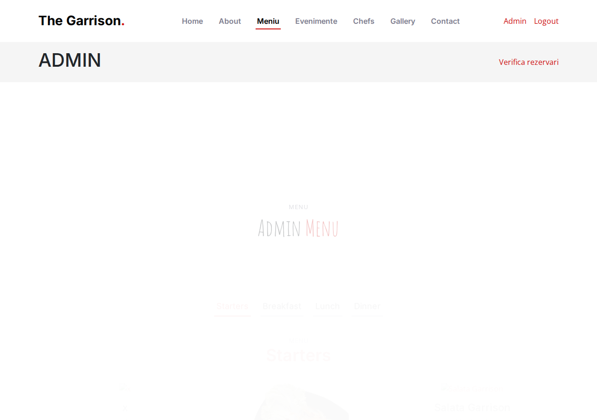
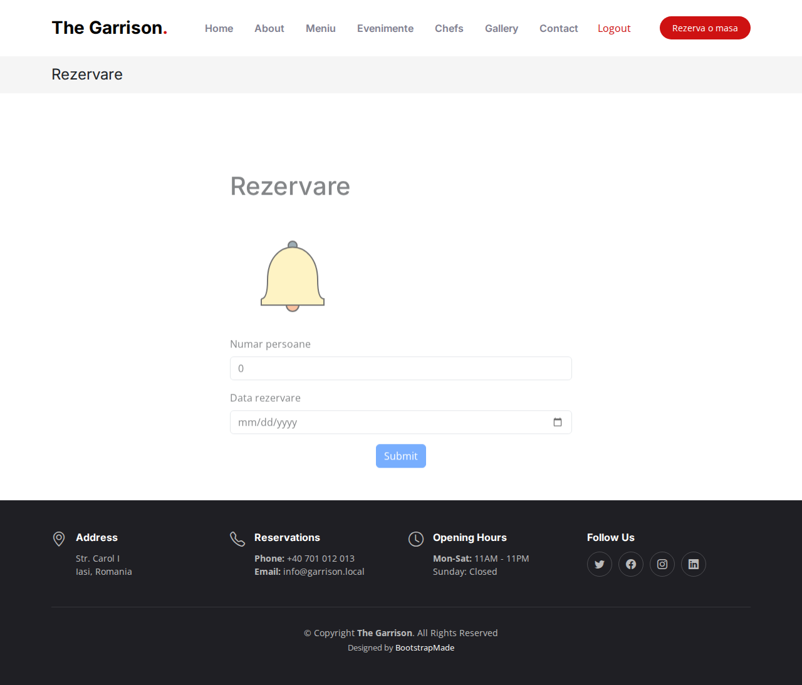

# The Garrison — Aplicatie web pentru restaurant

Aplicatie full-stack pentru un restaurant fictiv: prezentare meniu, sistem de
rezervare a meselor, autentificare separata pentru clienti si administratori,
si un panou de admin pentru gestionarea meniului (adaugare / editare / stergere
produse cu upload de imagine).

## Screenshot-uri






## Functionalitati

- **Autentificare & inregistrare** pentru clienti, cu sesiuni PHP si optiune
  "Remember me" (token persistent, hash-uit, stocat in cookie).
- **Autentificare separata pentru admin**, cu acces la un panou dedicat.
- **Panou de admin**: adaugare, editare si stergere produse din meniu, pe
  fiecare categorie (Starters, Breakfast, Lunch, Dinner), cu upload de imagine
  si validare de format (jpg/png/jpeg).
- **Meniul public** afiseaza doar produsele adaugate efectiv de admin, grupate
  pe categorie — fara continut demo.
- **Sistem de rezervari**: verifica automat daca exista o masa libera pentru
  numarul de persoane si data ceruta, inainte de a confirma rezervarea.
- **Cautare live (AJAX)** a rezervarilor existente, din panoul de admin.
- **Protectie reCAPTCHA v2** pe formularul de login.

## Stack tehnic

- PHP 8.2 (Apache), MySQL, phpMyAdmin — orchestrate cu Docker Compose
- mysqli cu prepared statements pentru toate interogarile catre baza de date
- Parole hash-uite cu `password_hash()` / verificate cu `password_verify()`
  (atat pentru clienti, cat si pentru admini)
- Sesiuni PHP + cookie-uri semnate (SHA-256) pentru "remember me"

## Rulare locala

1. Copiaza `.env.example` in `.env` si completeaza cheile reCAPTCHA
   (le obtii gratuit de la https://www.google.com/recaptcha/admin — sau lasa
   campurile goale in dezvoltare locala, verificarea reCAPTCHA se dezactiveaza
   automat daca nu sunt setate).

2. Porneste containerele:

   ```bash
   docker-compose up --build
   ```

3. Acceseaza:
   - Site: http://localhost:8080
   - phpMyAdmin: http://localhost:8081 (user `root`, parola `toor`)

Tabelele bazei de date se creeaza automat la prima pornire
(`db-init/schema.sql`, rulat de containerul MySQL).
Un cont de admin implicit este creat automat la prima accesare a site-ului:

- **Email:** `admin@garrison.com`
- **Parola:** `admin123`

Se recomanda schimbarea acestei parole imediat dupa primul login (direct din
phpMyAdmin, folosind `password_hash()` din PHP pentru noua valoare).

## Decizii tehnice de retinut

- Toate interogarile SQL folosesc **prepared statements**, ca sa evite
  SQL injection — inclusiv formularul de cautare live, care primeste input
  direct de la utilizator.
- Parolele nu sunt niciodata stocate in clar; se foloseste `password_hash()`
  cu algoritmul implicit al PHP (bcrypt), atat pentru clienti cat si pentru
  administratori.
- Cheile secrete (reCAPTCHA) nu sunt hard-codate in cod — se citesc din
  variabile de mediu, injectate de Docker Compose dintr-un fisier `.env`
  local, care nu e urcat pe git.
- Schema bazei de date e versionata in repo (`db-init/schema.sql`), astfel
  incat proiectul sa poata fi clonat si pornit de la zero fara pasi manuali
  de configurare a bazei de date.

## Structura proiectului

```
src/
  index.php, login.php, signup.php   -> pagini publice / autentificare
  secure.php                          -> panou admin (listare meniu)
  add.php, update.php, delete.php     -> CRUD meniu (doar admin)
  rezervare.php                       -> formular rezervare masa
  search.php, livesearch.php          -> cautare live rezervari (admin)
  function.php                        -> helpere sesiune / remember-me
  dbconnection.php                    -> conexiune DB + seed admin implicit
  assets/clase/                       -> clasele Mancare si Rezervare
db-init/schema.sql                    -> schema bazei de date (auto-rulata)
db-init/migration_add_categorie.sql   -> migrare manuala pt. baze de date existente
docker-compose.yml, Dockerfile        -> orchestrare containere
```

Produsele din meniu apartin uneia dintre categoriile `starters`, `breakfast`,
`lunch`, `dinner` (coloana `categorie` din tabelul `meniu`). Formularele de
adaugare/editare din panoul de admin includ un selector de categorie, iar atat
panoul de admin cat si meniul public afiseaza produsele grupate corect pe
fiecare categorie.
