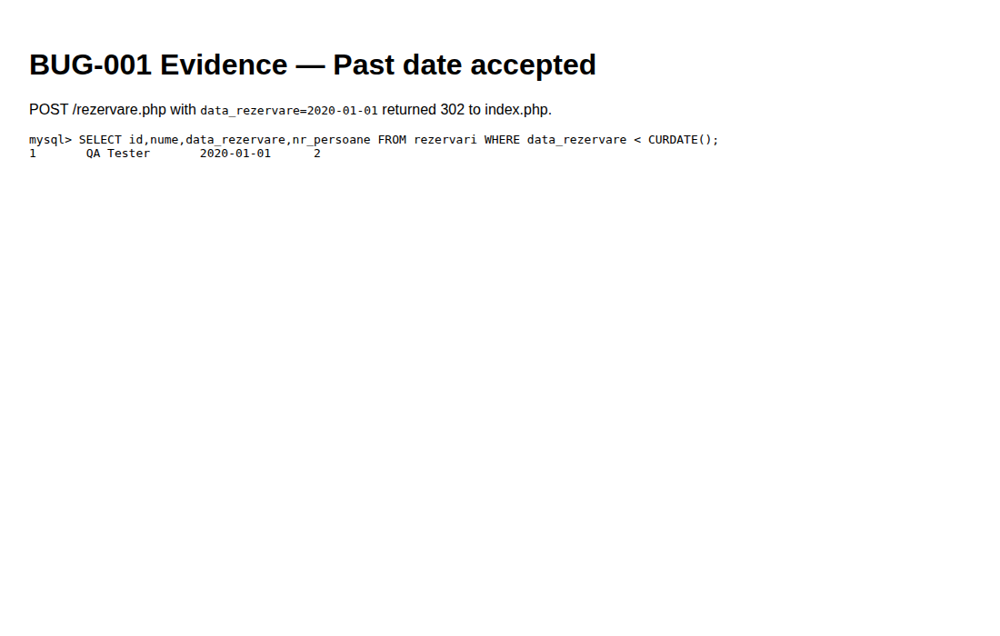

# BUG-001 — Past reservation dates are accepted

| Field | Value |
|-------|--------|
| Severity | **High** |
| Priority | High |
| Status | Open |
| Environment | Local Docker / host-network PHP + MySQL 8.0 · http://127.0.0.1:8080 |
| Module | Reservations |
| Related case | RES-06 |

## Summary

The reservation form accepts historical dates (e.g. `2020-01-01`) and persists them in `rezervari`.

## Steps to reproduce

1. Sign up / log in as a customer.
2. Open `/rezervare.php`.
3. Set **Numar persoane** = `2`.
4. Set **Data rezervare** = `2020-01-01`.
5. Submit.

## Expected

Validation error; no database insert for past dates.

## Actual

HTTP 302 to `index.php`. Row created:

```text
id=1  nume=QA Tester  data_rezervare=2020-01-01  nr_persoane=2
```

## Evidence



## Notes / root cause hint

`rezervare.php` validates empty date and party size only; no comparison against today before `Rezervare::verifica_rezervare()`.
