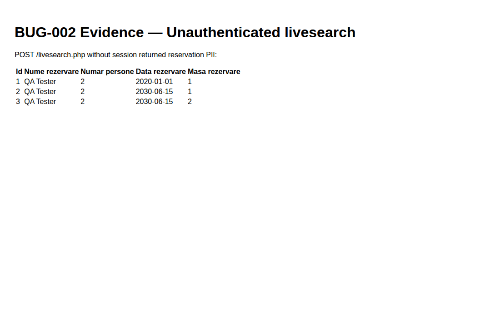

# BUG-002 — `livesearch.php` leaks reservation data without authentication

| Field | Value |
|-------|--------|
| Severity | **Critical** |
| Priority | High |
| Status | Open |
| Environment | Local · http://127.0.0.1:8080 |
| Module | Search |
| Related case | SRCH-07 |

## Summary

`POST /livesearch.php` returns reservation PII for any caller. There is no session / admin check (unlike `/search.php`).

## Steps to reproduce

1. Log out (or use a clean browser / curl without cookies).
2. `curl -X POST http://127.0.0.1:8080/livesearch.php -d 'input=QA'`
3. Observe HTML table in the response.

## Expected

Unauthorized response (redirect to login, 403, or empty body). No reservation names/dates/table IDs.

## Actual

Full results table including customer name, party size, date, and table id.

## Evidence

## Notes / root cause hint

`search.php` guards with `is_admin_logged_in()`, but `livesearch.php` only opens the DB and runs `LIKE` — callable directly via AJAX URL.
