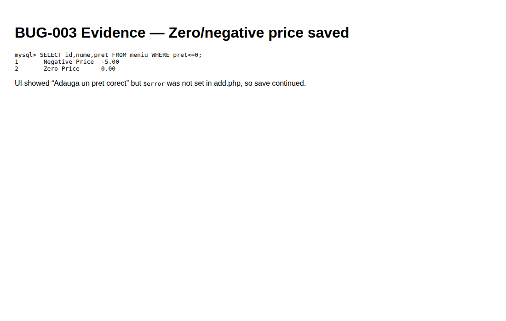

# BUG-003 — Zero and negative menu prices are saved

| Field | Value |
|-------|--------|
| Severity | **High** |
| Priority | High |
| Status | Open |
| Environment | Local · admin session |
| Module | Menu admin |
| Related cases | MENU-07, MENU-08 |

## Summary

On **Add product**, invalid prices (`0`, negative) show “Adauga un pret corect” in the UI path for messaging, but the server still saves the product because `$error` is never set for that branch.

## Steps to reproduce

1. Log in as admin.
2. Open `/add.php`.
3. Fill name, description, category, valid image.
4. Set price to `-5` (or `0`).
5. Submit.

## Expected

Submit blocked; no `meniu` row.

## Actual

302 to `secure.php`. Rows present:

```text
1  Negative Price  -5.00
2  Zero Price       0.00
```

## Evidence



## Notes / root cause hint

In `add.php`, the `$pret <= 0` branch sets `$pret_err` but omits `$error = true;` (contrast with `update.php`, which sets `$error = true`).
