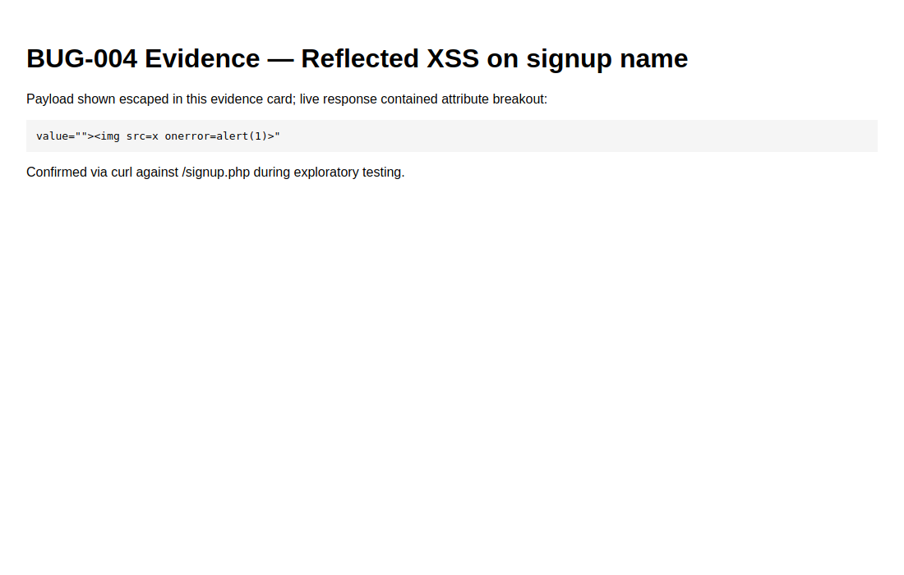

# BUG-004 — Reflected XSS via signup name field

| Field | Value |
|-------|--------|
| Severity | **High** |
| Priority | High |
| Status | Open |
| Environment | Local · `/signup.php` |
| Module | Auth |
| Related case | AUTH-02 (extends validation/escaping) |

## Summary

Failed signup re-renders `name` into the input `value` attribute without escaping, allowing attribute breakout and script execution.

## Steps to reproduce

1. Open `/signup.php`.
2. Set name to: `">`
3. Set an invalid email (e.g. `x`) so validation fails.
4. Submit.
5. View page source / rendered DOM for the name field.

## Expected

Value HTML-escaped (`&quot;`, `&lt;`, etc.). No extra elements injected.

## Actual

Rendered roughly as:

```html
value="">"
```

## Evidence



## Notes / root cause hint

`signup.php` uses `value="<?=$name?>"` without `htmlspecialchars`. Login error text uses `htmlspecialchars` inconsistently elsewhere.
