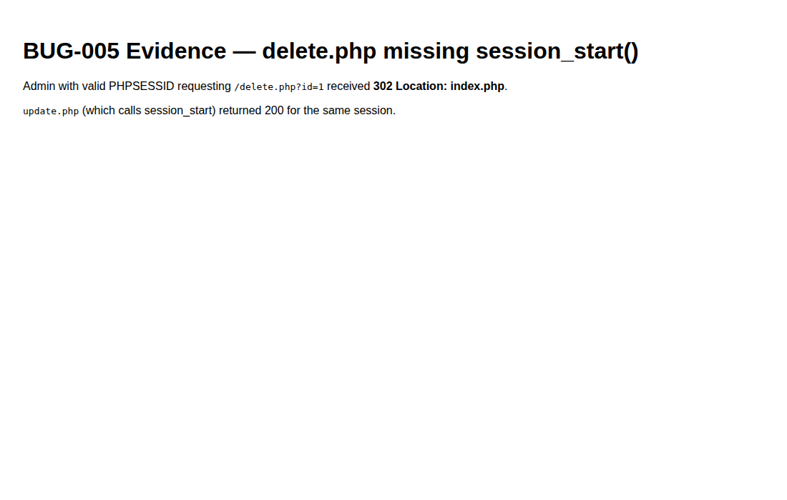

# BUG-005 — Admin cannot open delete confirmation (`session_start` missing)

| Field | Value |
|-------|--------|
| Severity | **High** |
| Priority | High |
| Status | Open |
| Environment | Local · admin PHP session (no remember-me cookie) |
| Module | Menu admin |
| Related cases | MENU-12, MENU-13 |

## Summary

`delete.php` does not call `session_start()`. With a normal admin session cookie only, `is_admin_logged_in()` is false and the user is redirected to `index.php`, so products cannot be deleted.

## Steps to reproduce

1. Log in as admin (no Remember Me).
2. From admin menu, open Delete for a product (`/delete.php?id=1`) **or** request it directly with the session cookie.
3. Observe response.

## Expected

Confirmation page: “Esti sigur ca vrei sa stergi…”.

## Actual

`302 Location: index.php`. Same session can open `/update.php?id=1` (200) because that file starts the session.

## Evidence

## Notes / root cause hint

`delete.php` requires `function.php` / DB but never `session_start()` before reading `$_SESSION['admin_id']`. Remember-me cookie path may still work via `admin_check_remember_me`, masking the bug.
