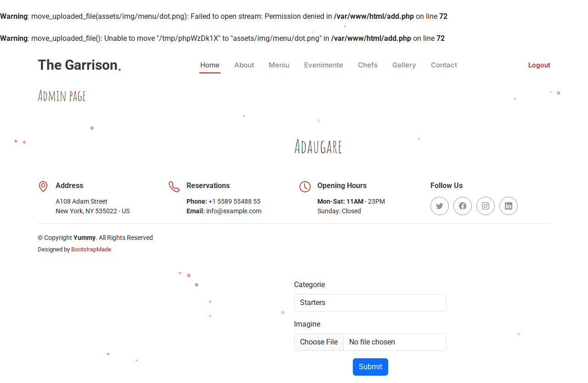

# BUG-009 — Menu image upload fails quietly when upload folder isn’t writable

| | |
|--|--|
| Severity | High |
| Priority | High |
| Status | Open |
| Build | Local Docker after fresh assets / clone |
| Area | Menu admin / setup |
| Cases | MENU-02, MENU-16, MENU-17 |

## Summary

Admin can fill Add product with valid name, price, description, category, and a PNG, then Submit — and the page just stays on `add.php` with no error. No product is created. On this Docker setup that happened because `src/assets/img/menu/` was not writable by the Apache user (`www-data`).

## Steps

1. Start the app with Docker Compose (host-mounted `src/`).
2. Confirm `src/assets/img/menu/` is `755` and owned by the host user (typical after clone).
3. Log in as admin.
4. Open Add product (`/add.php`).
5. Fill valid fields, price `15.00`, attach a small PNG.
6. Submit.

## Expected

Redirect to admin menu (`secure.php`) and the new item listed. Or, if the upload can’t be saved, a clear error on the form.

## Actual

URL stays on `/add.php`. No alert. Folder still has no new file. Playwright smoke `admin can add a menu item with valid price` fails with timeout waiting for `secure.php`.

## Screenshot

## Notes

- After `chmod 777 src/assets/img/menu` (or making the folder writable by `www-data`), the same steps succeed and smoke goes green.
- Closely related to BUG-007: when `move_uploaded_file()` fails, `add.php` never sets a user-visible error either.
- Worth fixing both the Docker/setup permissions and the silent failure path.
