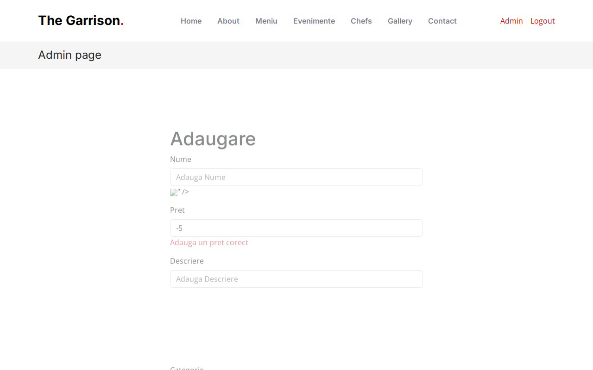

# BUG-009 — Add product form reflects HTML / script without escaping

| | |
|--|--|
| Severity | High |
| Priority | High |
| Status | Open |
| Build | Current main, http://127.0.0.1:8080/add.php |
| Area | Menu admin |
| Case | MENU-17 |

## Summary

On Add product, if validation fails (e.g. bad price), the submitted name and description are written back into the inputs **without** `htmlspecialchars`. A payload can break out of the `value="..."` attribute.

Signup was fixed for this pattern (BUG-004), but `add.php` still echoes raw `$nume` / `$descriere` / `$pret`.

## Steps

1. Log in as admin.
2. Open `/add.php`.
3. Name: `">`
4. Description: `"><svg/onload=alert(2)>`
5. Price: `-5` (so the form fails validation).
6. Submit (image optional for this path).
7. View page source around the name / description fields.

## Expected

Escaped attributes, e.g. `value="&quot;&gt;&lt;img ..."`.

## Actual

```html
value="">"
```

and the same pattern for description with the SVG payload.

## Screenshot



## Notes

Public menu and admin list already escape when rendering stored items. This is a reflected issue on the add form re-display. `update.php` keeps showing DB values on validation failure (so it doesn’t reflect the POST payload the same way), but should still escape for consistency.
