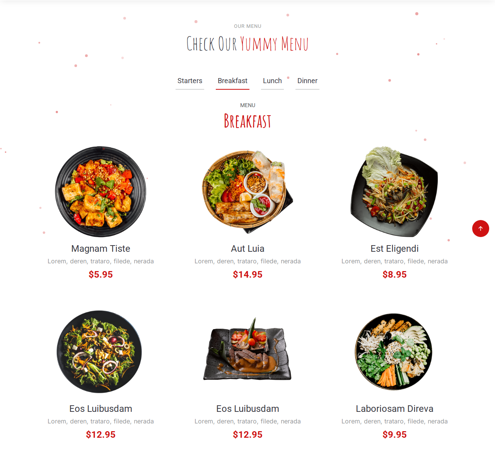

# BUG-010 — Public menu still shows hard-coded demo dishes

| | |
|--|--|
| Severity | Medium |
| Priority | Medium |
| Status | Open |
| Build | Local, public home page |
| Area | Public menu |
| Case | MENU-15 |

## Summary

README says the public menu only shows products the admin added — no demo content. Starters are loaded from the DB, but Breakfast / Lunch / Dinner tabs still show the old Yummy template dishes (e.g. “Magnam Tiste”) with template images under `assets/img/menu/menu-item-*.png`.

## Steps

1. Open the home page (logged out is fine).
2. Scroll to Our Menu.
3. Open the Breakfast tab (same for Lunch / Dinner).
4. Compare with Starters (DB-driven) and with an empty category in admin.

## Expected

Only real rows from `meniu`, grouped by category. Empty category → empty / “no products” style content, not template placeholders.

## Actual

Breakfast / Lunch / Dinner still list hard-coded items like Magnam Tiste, Aut Luia, etc., even when those products were never added in admin.

## Screenshot

## Notes

Looks left over from the BootstrapMade Yummy template in `components/menu.php`. Conflicts with the project README claim and with MENU-15.
