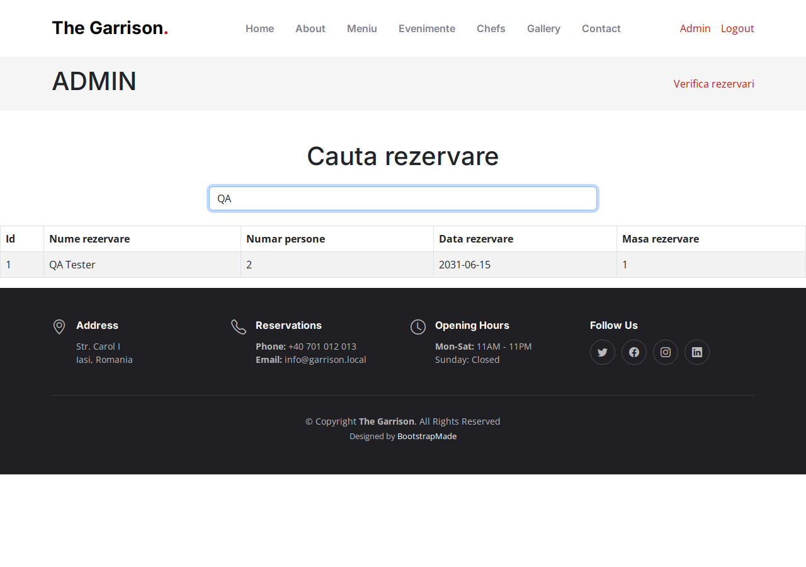

# BUG-010 — Live search column typo: “persone”

| | |
|--|--|
| Severity | Low |
| Priority | Low |
| Status | Open |
| Build | Current main, admin live search |
| Area | UI copy |
| Case | SRCH-10 |

## Summary

The live search results table header says “Numar persone”. Correct Romanian is “persoane”.

The admin button typo “rezevari” from BUG-006 is fixed; this one is still open on the AJAX results markup.

## Steps

1. Log in as admin.
2. Open `/search.php`.
3. Type a prefix that matches an existing reservation (e.g. `QA`).
4. Read the party-size column header in the results table.

## Expected

“Numar persoane”

## Actual

“Numar persone”

## Screenshot

## Notes

String lives in `livesearch.php` table header markup.
