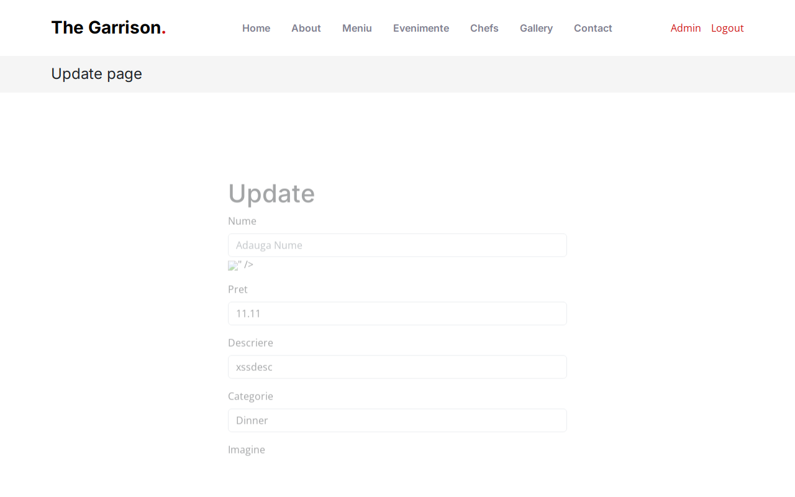

# BUG-012 — Stored XSS on Update product page

| | |
|--|--|
| Severity | High |
| Priority | High |
| Status | Open |
| Build | Current main, `/update.php?id=…` |
| Area | Menu admin |
| Related | BUG-009 (add form reflected XSS) |

## Summary

Public menu and `secure.php` escape product fields. The **Update** form does not: it writes `$mancare->nume`, `$descriere`, `$pret`, and `$imagine` raw into HTML attributes / `img src`.

If an admin (or any path that can add) saves a malicious name with a valid price/image, opening Update breaks out of `value="..."` and runs script in the admin session.

## Steps

1. As admin, add a product with name `">`, price `11.11`, valid PNG.
2. Open Update for that product.
3. Inspect the name field markup (or watch for the broken image / alert).

## Expected

Escaped attributes, e.g. `value="&quot;&gt;&lt;img …"`.

## Actual

```html
value="">"
```

## Screenshot



## Notes

Add form re-display is BUG-009. This is the **stored** path on Update after a successful save.
