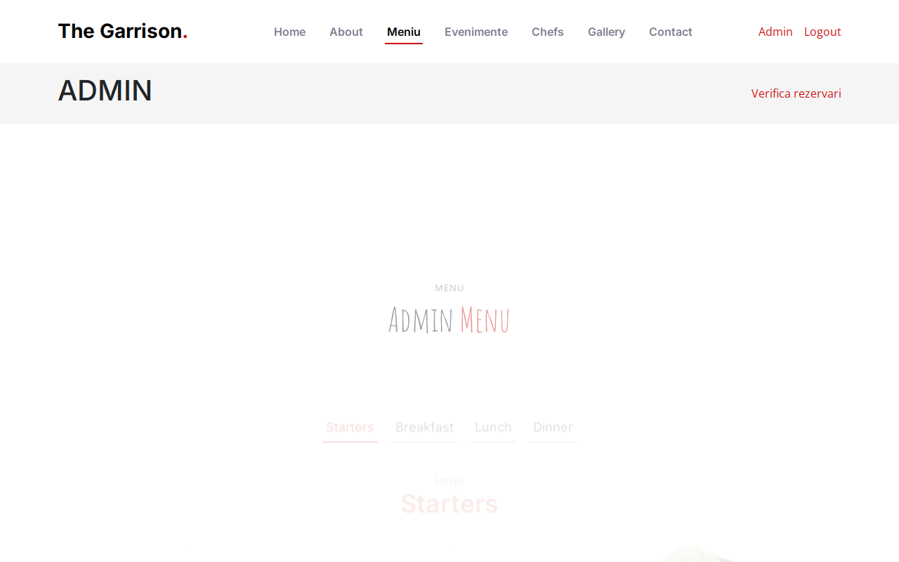

# BUG-017 — Admin can’t open the reservation page

| | |
|--|--|
| Severity | Low |
| Priority | Low |
| Status | Open |
| Build | Local |
| Area | Roles / UX |
| Case | RES-12 |

## Summary

Logged in as admin, I opened `/rezervare.php`. I got bounced to login and then straight back to the admin panel. No booking form, no message. The “Rezerva o masa” button also isn’t shown for admin.

## Steps

1. Log in as `admin@garrison.com`.
2. Open `/rezervare.php`.
3. See where you land.

## Expected

Either the booking form works for admin, or a clear “admins can’t book here / use a customer account” message.

## Actual

Redirect to login, then to admin. Ends on the admin panel with no explanation.

## Screenshot

## Notes

Might be intentional, but it’s confusing when you’re exploring as admin.
